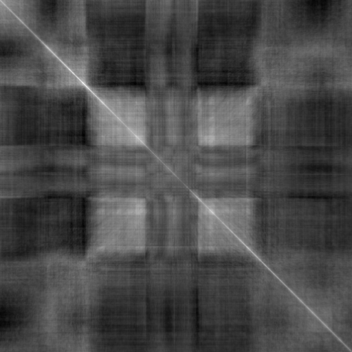
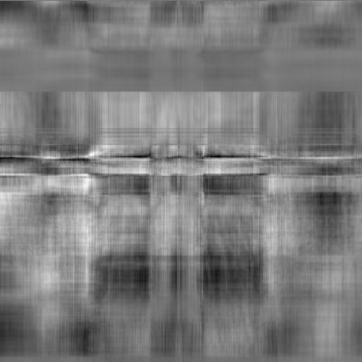

# Multiplying monochrome images as matrices: A*B and softmax

Materials related to my virtual poster at JuliaCon 2021: https://pretalx.com/juliacon2021/talk/review/VDM9RXRBZQDG79XHCMKSJTHPYNE9TRLS

Poster video (3 min): https://www.youtube.com/watch?v=CM7cuxYdbRg

All JuliaCon 2021 posters: https://juliacon.org/2021/posters/

---

I obtained images like

and

via matrix multiplication.

---

### ✅ `I am looking for collaborators (ping me by opening an issue).`

---

My poster proposal for JuliaCon 2021

https://github.com/anhinga/julia-notebooks/blob/main/images-as-matrices/presentation/talk-proposal.md

https://github.com/anhinga/julia-notebooks/blob/main/images-as-matrices/presentation/commentary.md

has been accepted. A 3 minute cover video for this virtual poster and the slide deck associated with this video can be found in the `slides-and-video` subdirectory.

The links to our current efforts in this direction can be found here:

https://github.com/anhinga/2021-notes/blob/main/matrix-mult-machines/README.md

---

Slides 1-4 of the slide deck correspond to

https://github.com/anhinga/julia-notebooks/blob/main/images-as-matrices/presentation/commentary.md

Slide 5 of the slide deck corresponds to `variations-4` notebook here (more specifically,
it corresponds to the last computation of the directed acycled dataflow graph of
image transformations in this notebook which composes
matrix multiplications with other image transformations):

https://github.com/anhinga/julia-notebooks/tree/main/grimoire-team/variations

The machine learning part of the slide deck corresponds to `may-23-switch-to-adam.ipynb` notebook here:

https://github.com/anhinga/julia-notebooks/tree/main/flux-may-2021

---

A number of auxiliary studies (scale invariance, modifications of `softmax` formulas, and such) are
referenced in the README here: https://github.com/anhinga/julia-notebooks/tree/main/images-as-matrices

---

A "signed normalization" experiment (conducted on July 7) sheds partial light onto the mechanism of
the effect produced by softmax normalization of the rows of the left matrix and the columns of right matrix.

See `signed-normalization` subdirectory; the "signed normalization" experiment is joint work with github user `nekel`.

---

An open problem in the ML Collective "Request for Plot" style: https://mlcollective.org/rfp/

It would be very interesting to try modifying formula 1 on page 4 of 
the famous "Attention Is All You Need" paper introducing the Transformer architecture: 
https://arxiv.org/abs/1706.03762  by also applying softmax normalization
to the **columns of the right-hand-side matrix**, _V_,
but one needs to be able to train some Transformers from scratch in the first place
to try that. 

Then one could investigate whether this change would be an improvement.

---

I might keep adding subdirectories to this repository with additional material.

---

### ✅ `I am looking for collaborators (ping me by opening an issue).`
