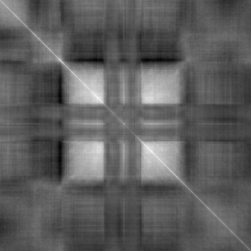
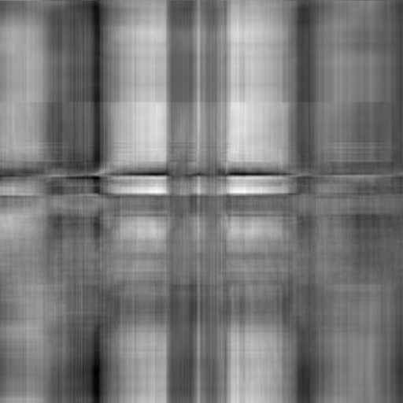

If we apply "signed normalization" before multiplying images as matrices
we reproduce "gross features" of softmax normalization of the rows of the left matrix
and the columns of right matrix, but not the fine-grained features.

Hopefully, this would shed partial light onto the reason for
"softmax normalization effect" here.

Joint work with github user `nekel` who proposed the idea to try
"signed normalization".

Here are the images we obtained:



and



The 'signed normalization" transformation is

```julia
function normalize_image_signed(img)
    img1 = img .- minimum(img)
    img2 = (2/maximum(img1))*img1
    return img2 .- 1
end
```

Note that the standard `imshow` normalization transformation which we apply before
displaying the matrix product is

```julia
function normalize_image(im)
    im_res = im .- minimum(im)
    return (1/maximum(im_res))*im_res
end
```

The Julia Jupyter notebook `signed-normalization.ipynb` in this subdirectory documents the experiment.
